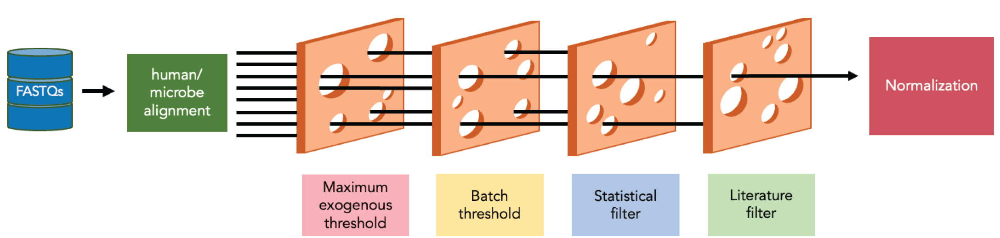

```{r setup, include=FALSE}
knitr::opts_chunk$set(echo = TRUE)
```


<style>
pre.red {
    background-color: #ffbbbb !important;
}
</style>

## Overview

*"Exogenous sequences in Tumors and Immune Cells"*

A tool for estimating the microbe abundances in tumor RNAseq data.

This package contains functions utilized for the processing and contaminant filtering of high throughput sequencing data to identify low abundance microbes.

{width=90%}

#### Human/microbe alignment
Exotic first maps raw reads with quality scores (FASTQs) to the human reference genome. Then, exotic aligns the unmapped reads to a wide range of non-human genomes, including bacteria, archaea, viruses, fungi, and a subset of other eukaryotes. 

#### Filtering
Filtering steps include the removal of samples with a high percentage of exogenous reads and samples from small batches that prevent contaminant checks, as well as reads that align to microbes found to be contaminants by statistical or literature review-based filtering. We have also included filters developed by fragmenting the human/mouse transcriptome/genome into overlapping segments, running through the pipeline, and identifying erroneously assigned microbes. 

#### Normalization
For analysis, we recommend using the unnormalized, filtered counts or the abundance relative to human calculated with the unnormalized, filtered counts.

```{red}
NOTE: We previously reccomended VOOM-SNM normalization. See functions format_voom_snm_expr()
and voom_snm_normalization() for this technique. We now advise against it due to false postives.
```


## Installation
The package can be installed from GitHub via devtools:
```{r, eval=FALSE}
install.packages("devtools")
devtools::install_github("spakowiczlab/exotic")
```

## Usage

### Download the databases
exotic requires use of the kraken2 with bracken database. All data necessary is available via https://go.osu.edu/exotic-database. Creation of a Globus account is required for access.  

### Input data
Input to the pipeline needs to be in the form of a folder containing fastQ files. If you are beginning with CRAM or BAM files please see [Starting from CRAM or BAM files](#starting-from-cram-or-bam-files). 

### Standard workflow
```{r, eval=FALSE}
library(exoticpackage)
library(drake)

# include example of drake pipeline here
```

#### 1. Generate genomic data commons manifest

This function interacts with the Genomic Data Commons API to obtain information on file ids for a given TCGA project. These are filtered to RNA-seq samples of the primary tumor.
```{r, eval=FALSE}
generate_TCGA_manifest(cname)
```

#### 2. Acquire TCGA clinical data

This function interacts with Genomic Data Commons to acquire TCGA clinical data for the list of samples provided in a file manifest as generated by the function generate_TCGA_manifest.
```{r, eval=FALSE}
grab_TCGA_clinical(filemanifest)
```

#### 3. Acquire TCGA metadata

This function interacts with Genomic Data Commons to pull the metadata used for normalization.
```{r, eval=FALSE}
grab_TCGA_metadata(tcga.file.ids, tcga.expression.ids)
```

#### 4. Remove samples with low human abundances

The exotic pipeline was built with the intention of processing human tumor samples. Samples with low human abundances are therefore suspiscious and should be removed.
```{r, eval=FALSE}
check_human_percentages(counts, req.percent)
```

#### 5. Prepare data for get_contaminants

This function is meant to handle the data manipulation required to prepare sample and meta data for the get_contaminants function.
```{r, eval=FALSE}
resolve_batches(
  metadf,
  countdf,
  conc.col.name,
  sample.col.name,
  batch.col.name
)
```

#### 6. Determine statistical contaminants

Determine statistical contaminants using RNA concentrations and sample batches.
```{r, eval=FALSE}
get_contaminants(metadf, countdf, seed)
```

#### 7. Compare statistical contaminants to literature contaminants

As a final filtering step before normalization, the results of checking for statistical contaminants are compared to the ccontaminants determined by literature review.
```{r, eval=FALSE}
resolve_contaminants(contams, counts, threshold = 0.1)
```

#### 8. Filter out false postives via human/mouse transcriptome/genome filter

Given a table where rows are samples and columns are species and a character vector of desired filters, removes species identified as human/mouse erroneously identified as microbial.
```{r, eval=FALSE}
transcript_genome_filter(counts, filters)
```


#### 9. Calculate rarefied prevalence of count data

Normalizing data with VOOM-SNM removes any zero counts to maintain compatibility with a log transformation, so for analyses requiring prevalence data it is better to use the rarefied prevalence of the unnormalized count data. This function rarefies to match the depth of the sample with the minimum counts in the provided table.
```{r, eval=FALSE}
counts_to_rarefied_prevalence(counts, seed)
```

#### 10. Calculate relative abundances of unnormalized counts per human

Given a table where rows are samples and columns are species, calculate the abundances relative to amount human for each sample. 
```{r, eval=FALSE}
calculate_abundance_relative_to_human(counts)
```

#### 11. Assign full taxonomy to species

Using a kraken2 report with metaphlan formatted output, assign to the normalized table resulting from voom_snm_normalization. This is also compatible with the unnormalized counts and rarefied prevalence outputs.
```{r, eval=FALSE}
assign_taxonomy(kraken.tax, species.tab)
```


## Related resources
Please see the [exotic-manuscript](https://github.com/spakowiczlab/exotic-manuscript) repository for the analyses related to the [manuscript](https://www.biorxiv.org/content/10.1101/2022.08.16.503205v1):

*Exogenous sequences in tumors and immune cells (exotic): a tool for estimating the microbe abundances in tumor RNAseq data. Rebecca Hoyd, Caroline E Wheeler, YunZhou Liu, Malvenderjit Jagjit Singh, Mitchell Muniak, Nicolas Denko, David Carbone, Xiaokui Mo, Daniel Spakowicz bioRxiv 2022.08.16.503205; doi: https://doi.org/10.1101/2022.08.16.503205*

## Starting from CRAM or BAM files
```{r echo=FALSE}
# DiagrammeR::grViz("digraph {
#   graph [layout = dot, rankdir = LR]
#   
#   node [shape = oval, color=lightsteelblue, style=filled]        
#   rec1 [label = 'Cram']
#   rec2 [label = 'Bam']
#   rec3 [label =  'Sorted Bam']
#   rec4 [label = 'FastQ']
#   
#   # edge definitions with the node IDs
#   rec1 -> rec2 -> rec3 -> rec4
#   }",
#   height = 100)
```

CRAM and BAM files are compressed versions of mapped sequence data formats. For use of the pipeline, they will need to be converted to the fastQ file format which is the decompressed version. Using [SAMtools](http://www.htslib.org/), CRAM files can be converted to BAM files, and BAM files can be converted to fastQ files. 

Install SAMtools in your UNIX environment following these [directions](http://www.htslib.org/download/). 

Convert CRAM -> BAM in batch
```{bash eval=FALSE}
module load samtools
cd /this/is/a/path/crams
for i in *.cram; do
filename=$(basename "$i")
fname="${filename%.*}"
if ! test -f $fname".bam"; then
samtools view -b -o $fname".bam" $i
fi
done
```


Sort the BAM files in a batch
```{bash eval=FALSE}
module load samtools
cd /this/is/a/path/bams
for i in *.bam; do
filename=$(basename "$i")
fname="${filename%.*}"
if ! test -f $fname"_sorted.bam"; then
samtools sort -n $i -o $fname"_sorted.bam"
fi
done
```


convert BAM -> fastq in batch
```{bash eval=FALSE}
module load samtools
cd /this/is/a/path/sorted_bams/
samtools fastq -@ 8 ",i," \\
                 paste0("-1 ",s,"_1.fastq.gz \\"),
                 paste0("-2 ",s,"_2.fastq.gz \\"),
                 paste0("-0 /dev/null -s /dev/null -n"),
```


## Methods we no longer reccomend 

#### Formatting TCGA microbe count or gene expression data for normalization 

These functions were meant to assist with formatting TCGA data processed with other exotic function for voom-snm normalization

TCGA microbe count data:
```{r, eval=FALSE}
format_voom_snm_microbe(tcga.counts, tcga.meta)
```

TCGA gene expression data: 
```{r, eval=FALSE}
format_voom_snm_expr(tcga.exp, tcga.meta)
```


#### Normalized decontaminanted counts

Normalizes count data using voom-snm. This removes variation from specified technical variables while preserving variation from specified biological variables. For projects only utilizing TCGA data, the functions format_voom_snm_microbe and format_voom_snm_expr automatically format inputs for this function.
```{r, eval=FALSE}
voom_snm_normalization(
  qcMetadata,
  qcData,
  biovars,
  adjvars,
  return.format = "logcpm",
  seed
)
```

#### Calculate relative abundances of normalized species counts

Given a table where rows are samples and columns are species, calculate the relative abundances for each sample.
```{r, eval=FALSE}
calculate_relative_abundance(counts)
```
